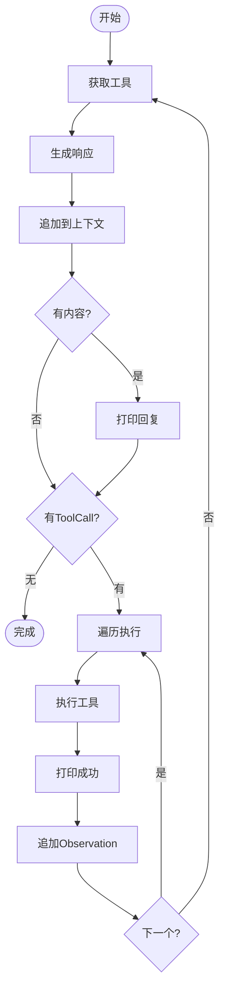
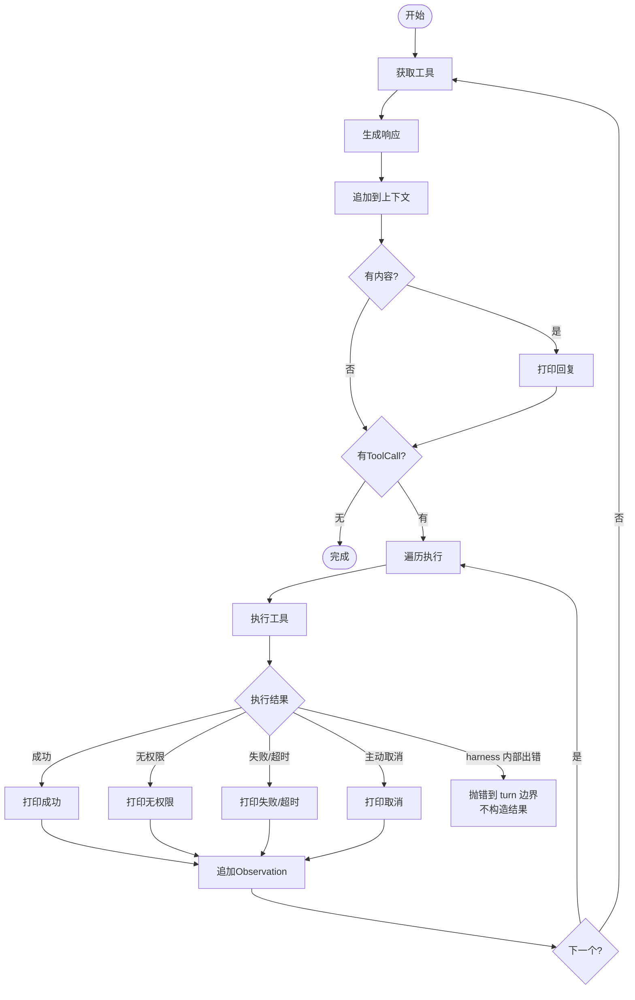

看了很多网上的资料和文章，一直对工具调用有个模糊的了解。
那就是在 agent 的 main loop 中会植入工具的描述，让模型判断是否需要调用工具，输入输出都有特定的格式，最后把模型输出的结果放到上下文中。

## 伪代码

```go
for {
	// 获取有效的工具
	availableTools := e.registry.GetAvailableTools()

	actionResp, err := e.provider.Generate(ctx, contextHistory, availableTools)
	if err != nil {
		return fmt.Errorf("Action 阶段生成失败: %w", err)
	}

	contextHistory = append(contextHistory, *actionResp)

	if actionResp.Content != "" {
		fmt.Printf("🤖 [对外回复]: %s\n", actionResp.Content)
	}

	// ================= 执行判断 =================
	if len(actionResp.ToolCalls) == 0 {
		log.Println("[Engine] 模型未请求调用工具，任务宣告完成。")
		break
	}
	for _, toolCall := range actionResp.ToolCalls {

		result := e.registry.Execute(ctx, toolCall)

		if result.IsError {
			log.Printf("  -> ❌ 工具执行报错: %s\n", result.Output)
		} else {
			log.Printf("  -> ✅ 工具执行成功 (返回 %d 字节)\n", len(result.Output))
		}

		observationMsg := schema.Message{
			Role:       schema.RoleUser,
			Content:    result.Output,
			ToolCallID: toolCall.ID,
		}
		contextHistory = append(contextHistory, observationMsg)
	}
}
```

## 简易流程图



## 但工具调用真的那么简单吗？

工具调用的结果有很多种情况。如果工具调用失败，或者没有这个工具，模型应该怎么继续执行下去？
这次我带着这个疑问，在 DeepSeek harness 里面看一下他们到底是怎么处理的。

AI 分析了一下工具执行的结果，大概分以下几种：

### 工具调用的处理场景

- 没有权限（deny / guard 拒绝）
- 工具调用失败、超时
- 调用成功
- harness 内部出错
- 主动取消

DeepSeek harness 工具调用代码：

```ts
const startCall = async (index: number): Promise<void> => {
  // oxlint-disable-next-line typescript/no-non-null-assertion -- bounded index
  const call = group[index]!
  // 这里使用数组桶存储工具调用任务，可以保证工具的乱序执行，顺序提交。
  callSeqs[index] = appendToolCall(session, turn, step, call.block)
  started++

  //  callerCancelled 检查 、 ask 中途被取消
  const prepared = await ctx.tools[TOOL_RUNTIME_SCHEDULER].prepare(call.exec)
  throwSchedulerFailure()
  switch (prepared.kind) {
    case 'dispatch': {

      // 工具调用放到池子里面去执行。
      const promise = ctx.tools[TOOL_RUNTIME_SCHEDULER].dispatch(prepared.exec).then(
        (outcome) => {
          slots[index] = { exec: prepared.exec, result: outcome.result, needsPost: outcome.kind === 'post-result' }
          return index
        },
        (error: unknown) => {
          schedulerFailure ??= { error }
          return index
        },
      )
      inFlight.set(index, promise)
      break
    }
    case 'post-result':
      slots[index] = { exec: prepared.exec, result: prepared.result, needsPost: true }
      break
    case 'final-result':
      slots[index] = { exec: prepared.exec, result: prepared.result, needsPost: false }
      break
    /* v8 ignore next -- closed-union exhaustiveness guard */
    default:
      assertNever(prepared, 'tool-call scheduler prepare result')
  }
}
```

#### 没有权限（deny / guard 拒绝）

**构造现场 — `prepareExecution` (tools/src/index.ts L1486-1499)**

```ts
// 1486-1499
const denialReason = decision.kind === 'allow'
  ? this.guardReason(exec)          // 即使 allow 也要走 guard 检查
  : decision.reason                 // pre-execute 瀑布返回 deny

if (denialReason !== undefined) {
  return await next({
    kind: 'post-result',          // ← 注意！
    exec,
    result: this.materializeFinalResult({
      content: [{ type: 'text', text: `Error: ${denialReason}` }],
      isError: true,
      error: { message: denialReason },
    }),
  })
}
```

**返回路径**：`prepare` 返回 `{ kind: 'post-result', exec, result }` → agent-loop 的 `startCall` 直接放进 `slots[index]`（`needsPost: true`）→ `commitReady` 调用 `finalize` → 跑 `tools/post-execute` 瀑布（审计/替换/block）→ `finish` 定稿。

#### 工具调用失败（body 抛异常）

**构造现场 — `dispatchToolBody` (tools/src/index.ts L1544-1555)**

```ts
try {
  const tool = this.resolveExecution(exec.name, exec.agent, exec.parent !== undefined)
  if (!tool) throw new ToolNotFoundError(exec.name)   // 工具不存在
  state.bodyInvoked = true
  const returned = await tool.execute(exec.arguments, exec)  // 跑工具 body
  const result = this.createSuccessResult(exec, tool, returned)
  return isAborted(signal) ? toolAbortedResult(result) : result
} catch (error: unknown) {
  return toolErrorResult(error)   // ← 所有异常归一
}
```

**`toolErrorResult` 构造函数 (tools/src/index.ts L1870-1878)**

```ts
function toolErrorResult(error: unknown): ToolExecutionResult {
  const info = errorInfo(error)
  const message = errorMessage(error)
  return {
    content: [{ type: 'text', text: `Error: ${message}` }],
    isError: true,
    error: { message, ...info ? { info } : {} },
  }
}
```

**返回路径**：catch 里 `return toolErrorResult(error)` → `dispatchScheduledExecution` 的 catch（L1596-1598）接住，返回 `{ kind: 'final-result', result: toolErrorResult(error) }` → agent-loop 的 `startCall` 的 `.then(onFulfilled)` 把 `outcome` 放进 `slots[index]`（`needsPost: false`）→ `commitReady` 调用 `finish`（跳过 post-execute，直接定稿）。

#### 工具调用失败 超时

**构造现场 — `timeout-policy` 插件 (guard/timeout-policy/src/index.ts L55-80)**

```ts
export function apply(ctx: Context): void {
  ctx.on('tools/execute', async (exec, next): Promise<ToolExecutionResult> => {
    const timeoutMs = ctx.tools.get(exec.name, exec.agent)?.timeoutMs
    if (timeoutMs === undefined) return next()     // 没有声明超时 → 跳过

    using d = deadline(exec.signal, timeoutMs, TOOL_TIMEOUT)
    const upstream = exec.signal
    exec.signal = d.signal                         // 把 deadline 信号换上去
    try {
      const result = await next()                  // 让工具跑（在 deadline 下）
      if (timeoutOf(d.signal, TOOL_TIMEOUT) !== undefined) {
        return toolTimeoutResult(timeoutMs)        // 自己的 timer 触发了 → 替换结果
      }
      return result                                // 工具正常返回 → 原样
    } finally {
      exec.signal = upstream                       // 恢复上游信号
    }
  })
}
```

`toolTimeoutResult` 就在同一文件 L41-47：

```ts
function toolTimeoutResult(timeoutMs: number): ToolExecutionResult {
  const message = `tool call timed out after ${timeoutMs}ms`
  return {
    content: [{ type: 'text', text: `Error: ${message}` }],
    isError: true,
    error: { message, info: { name: 'ToolTimeoutError', code: TOOL_TIMEOUT } },
  }
}
```

**返回路径**：`tools/execute` 瀑布的 `next()` 返回这个替换结果 → `dispatchScheduledExecution` 收到（L1573-1576）→ 正常返回 `{ kind: 'post-result', result }` 给 agent-loop → 走 `finalize`（含 post-execute）。

> 注意：超时不是"工具被强杀"，而是 deadline 的 signal 先 abort，工具协作式地响应（或忽略），harness 不等它（"without racing or abandoning"）。插件在 `next()` 返回后检查 `timeoutOf` 确认是自己的 timer 触发，然后替换结果文本。

---

#### 调用成功

**构造现场 — `dispatchToolBody` (tools/src/index.ts L1546-1553)**

```ts
const tool = this.resolveExecution(exec.name, exec.agent, exec.parent !== undefined)
if (!tool) throw new ToolNotFoundError(exec.name)
state.bodyInvoked = true
const returned = await tool.execute(exec.arguments, exec)   // 工具 body 正常返回
const result = this.createSuccessResult(exec, tool, returned) // 验证输出 + 渲染
return isAborted(signal) ? toolAbortedResult(result) : result
```

**`createSuccessResult` (tools/src/index.ts L1792-1823)**

```ts
private createSuccessResult(exec: ToolExecution, tool: ToolDefinition, candidate: unknown): ToolExecutionSuccess {
  const detached = snapshotToolValue(tool.name, candidate)   // 确保 JSON 无损
  const violations = validateJsonSchemaValue(tool.output.schema, detached, 'value')  // 验证 schema
  if (violations.length > 0) throw new ToolOutputError(tool.name, violations)
  const value = deepFreeze(detached)
  let rendered: ContentBlock[]
  try {
    rendered = tool.output.render(exec.arguments, value)      // 渲染成模型可见文本
  } catch (error: unknown) {
    throw projectionError(tool.name, 'render', error)
  }
  const content = snapshotProjection(tool.name, 'render', rendered)
  // ... 如果有 presentationMeta 也投影
  const concludesTurn = this.concludingExecutions.has(exec)
  return this.markCanonical(exec, this.materializeFinalResult({
    isError: false,
    value,
    content,
    ...meta !== undefined ? { meta } : {},
    ...concludesTurn ? { concludesTurn: true as const } : {},
  }) as ToolExecutionSuccess)
}
```

**返回路径**：`createSuccessResult` 返回 `isError: false` 的 result → `dispatchToolBody` 正常返回 → `dispatchScheduledExecution` 接住（L1573-1576）→ 检查 `callerCancelled`（L1591-1594）没取消 → 返回 `{ kind: 'post-result', result }` → agent-loop 的 `startCall` 的 `.then` 放进 `slots[index]` → `commitReady` 调用 `finalize` → `tools/post-execute` 瀑布 → `finish` 定稿 → `appendToolResult` 写 session。

---

#### harness 内部出错（调度器崩溃 / dispatch reject）

**构造现场 — `tool-calls.ts` (agent-loop L178-181)**

```ts
case 'dispatch': {
  const promise = ctx.tools[TOOL_RUNTIME_SCHEDULER].dispatch(prepared.exec).then(
    (outcome) => {
      slots[index] = { exec: prepared.exec, result: outcome.result, needsPost: outcome.kind === 'post-result' }
      return index
    },
    (error: unknown) => {
      schedulerFailure ??= { error }   // ← 记录内部错误，不构造 result
      return index                     // 返回 index，让主循环在检查点抛出
    },
  )
  inFlight.set(index, promise)
}
```

**抛出点 — `throwSchedulerFailure()` (L141-143 + 各检查点)**

```ts
const throwSchedulerFailure = (): void => {
  if (schedulerFailure !== undefined) throw schedulerFailure.error
}
```

主循环在 `fillPool` 和 `commitReady` 之间反复调用它（L207、L209、L223、L225），一旦被抛出，进入 catch 块：

```ts
// L231-235
} catch (error: unknown) {
  schedulerFailure ??= { error }
  await Promise.allSettled(inFlight.values())   // 等所有在飞 dispatch 结束
  throw schedulerFailure.error                  // 重新抛出，传播到 turn 边界
}
```

**返回路径**：`throw` → `executeToolCalls` 外层的 `step()` 的 try（agent.ts L395-398）→ 没有 catch 它 → 向上到 `turn()` 的 catch（L302-315）→ 设置 `turnEnds = { kind: 'error', error: ... }` → `turn()` 重新 throw → 驱动层（`driver`）处理。

**关键特征**：**不构造 `tool/result`**，不调用 `appendSkippedToolCall`，已记录的 `tool/call` 保留但无对应结果。模型看不到这条调用的任何反馈。

---

#### 主动取消

分三种子情况，取决于取消发生的时机：

##### 准备阶段就取消（body 未启动）

**`prepareExecution` (tools/src/index.ts L1470-1472)**

```ts
if (this.callerCancelled(exec)) {
  return next({ kind: 'final-result', exec, result: toolAbortedBeforeDispatchResult() })
}
```

`toolAbortedBeforeDispatchResult` (L1933-1943)：

```ts
function toolAbortedBeforeDispatchResult(prior?: ToolExecutionResult): ToolExecutionResult {
  const additionalContexts = prior?.additionalContexts ?? []
  return {
    content: [{ type: 'text', text: 'Error: tool call aborted before dispatch' }],
    isError: true,
    error: {
      message: 'tool call aborted before dispatch',
      info: { name: 'AbortError', code: TOOL_ABORTED_BEFORE_DISPATCH },
    },
    ...additionalContexts.length > 0 ? { additionalContexts } : {},
  }
}
```

**返回路径**：`prepare` 返回 `final-result` → `startCall` 直接放进 `slots`（`needsPost: false`）→ `commitReady` 调用 `finish` 定稿。

##### dispatch 阶段取消（body 已启动）

**`dispatchToolBody` (tools/src/index.ts L1548-1553)**

```ts
state.bodyInvoked = true
const returned = await tool.execute(exec.arguments, exec)  // 等工具跑完
const result = this.createSuccessResult(exec, tool, returned)
return isAborted(signal)                                  // 跑完后检查 signal
  ? toolAbortedResult(result)                             // 标记 ABORTED
  : result
```

`toolAbortedResult` (L1919-1929)：

```ts
function toolAbortedResult(prior?: ToolExecutionResult): ToolExecutionResult {
  const additionalContexts = prior?.additionalContexts ?? []
  return {
    content: [{ type: 'text', text: 'Error: tool call aborted' }],
    isError: true,
    error: {
      message: 'tool call aborted',
      info: { name: 'AbortError', code: TOOL_ABORTED },
    },
    ...additionalContexts.length > 0 ? { additionalContexts } : {},
  }
}
```

**返回路径**：`dispatchToolBody` 返回 `ABORTED` → `dispatchScheduledExecution` 收到 → 再检查 `callerCancelled`（L1591-1594）→ `cancellationResult` 择一 → 返回 `{ kind: 'post-result', result }` → `startCall` 的 `.then` 放进 `slots`（`needsPost: true`）→ `commitReady` 调 `finalize` → `tools/post-execute` 后定稿。

##### abort 时未启动的调用（agent-loop 补合成）

**`appendSkippedToolCall` (tool-calls.ts L248-259)**

```ts
function appendSkippedToolCall(session: Session, turn: number, step: number, block: ToolCallBlock): void {
  const callSeq = appendToolCall(session, turn, step, block)    // 先写 tool/call
  appendToolResult(session, turn, step, block, {                // 马上补 tool/result
    content: [{ type: 'text', text: 'Error: tool call aborted before dispatch' }],
    isError: true,
    error: {
      message: 'tool call aborted before dispatch',
      info: { name: 'AbortError', code: TOOL_ABORTED_BEFORE_DISPATCH },
    },
  }, callSeq)
}
```

### 最终流程图



最后发现的结果是，除了 harness 内部出错（工具调用的输出会在工程上构造），其他情况都有明确的错误类型或原因，都会返回到大模型的上下文中，让大模型继续判断下一步操作。工程上并没有对某些情况做强制结束或熔断。我原本以为，工程上会有一些更巧妙的方式来处理这类错误，但在这里没有看到。

不过，我能了解到的是：错误的输出及失败原因交给大模型去判断、去纠正，在下一轮得出结果——这是一种比较普遍且正确的解决办法。

此外我还注意到，如果一个工具已经调用，后续用户终止了，这个调用是不会被强制取消的——其实也没有办法取消，因为请求已经发出去了，操作可能已经执行完了，只是会有一个额外的通知。

这让我想到，在 harness 工具里面可能很少有强一致性，最终都是弱一致性、最终一致性。既然工具已经调用了，这个错误无法撤销，那我应该提供一个逆操作的方法。比如转钱这个操作，当转钱请求已经发出去了，用户想终止，应该提供一个退钱的接口，来保证最终事务的一致性。

最后我发现里面有一个超时插件特别简单，代码只有 100 多行。插件概念在 DeepSeek harness 里面也特别火，改天研究一下。