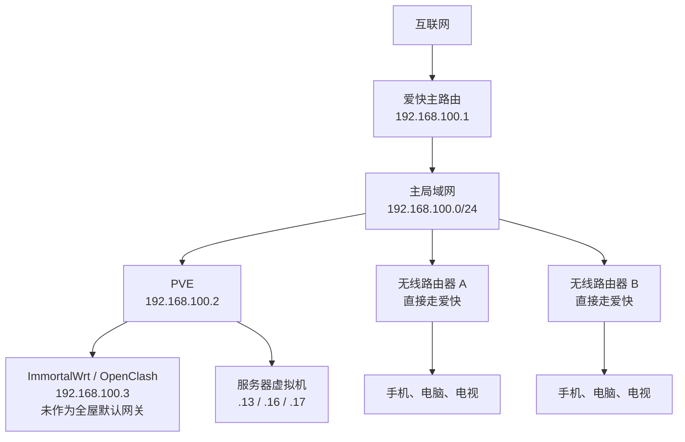
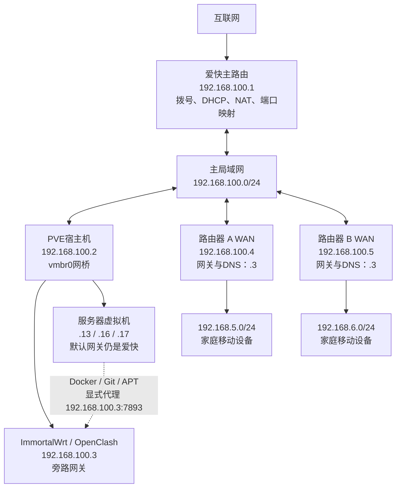

今天基本一整天都在折腾家里的网络。

我的想法其实很简单：不想再给每台手机、电脑单独装代理软件，也不想日本节点一超时，就得打开 OpenClash手动换节点。另外，家里服务器上还跑着一些 CPA和自用服务，Docker、Git、APT也经常需要访问外部资源，所以最好把服务器这部分一起处理掉。

既然都开始折腾了，我又顺手整理了公网访问。以前不少服务都是“域名 + 端口 + HTTP”，虽然能用，但没有加密，端口也越来越乱。这次就一起上了 Nginx Proxy Manager和 HTTPS。

最后做出来的效果是：家里人连上 Wi-Fi就能直接使用代理，国外流量优先走日本，节点挂了会自动切换；服务器仍然保留原来的爱快网关和端口映射，只让 Docker、Git、APT等需要外网的程序单独走 OpenClash；部分对外服务也已经可以通过 HTTPS访问。

## 改造前：能用，但比较零散

改造前，爱快负责拨号、DHCP、NAT和端口映射，两台无线路由器也都直接把爱快作为上级网关。

OpenClash虽然已经运行在 PVE里的 ImmortalWrt虚拟机中，但家里的移动设备并不会自动经过它。谁需要代理，谁就在自己的设备上单独配置。



这套网络平时上网没问题，但有几个地方让我觉得很麻烦：

- 手机和电脑要分别安装、维护代理；
    
- 家里人换设备以后还得重新设置；
    
- OpenClash手动选中的日本节点失效后不会自动换；
    
- CPA、Docker和 Git等场景需要一个比较稳定的日本出口；
    
- 对外服务大量使用 HTTP和高位端口，管理起来越来越乱。
    

所以这次我想做的，不只是“让某台电脑能翻墙”，而是把代理真正放进家庭网络里，让它对家里人尽量无感。

## 改造后：两台无线路由器统一经过 OpenClash

我的主路由还是爱快，地址是 `192.168.100.1`。PVE是 `192.168.100.2`，ImmortalWrt虚拟机是 `192.168.100.3`。

我给两台无线路由器的 WAN分别设置了固定地址：

```
路由器A：192.168.100.4
路由器B：192.168.100.5
网关：192.168.100.3
DNS：192.168.100.3
```

两台路由器的 LAN继续使用不同网段：

```
路由器A：192.168.5.0/24
路由器B：192.168.6.0/24
```

改造后的拓扑是这样的：



这里有一点很容易画错：`192.168.100.3` 虽然运行在 PVE中，但 PVE并不是它的上级路由器。ImmortalWrt通过 `vmbr0` 接入主局域网，在网络逻辑上和爱快、两台无线路由器、服务器都属于同一个 `192.168.100.0/24` 网段。PVE在这里只负责承载虚拟机和二层转发。

现在家里设备的流量大致是：

```
手机或电脑 → 无线路由器 → ImmortalWrt / OpenClash → 爱快 → Internet
```

这样一来，家里人根本不需要知道代理软件怎么配置。连接 Wi-Fi后，国内网站正常直连，国外网站则由 OpenClash按规则处理。

## 不再手动切日本节点

我平时有 CPA和移动设备使用日本出口的需求，所以希望出口尽量固定在日本。

以前我的做法是直接在 OpenClash里手动点一个日本节点。问题也很明显：节点一旦超时或者失效，流量就直接断了，我还得重新打开控制面板，再手动选一个能用的日本节点。

这次我新建了一个“日本自动”策略组：

```
类型：url-test
范围：只包含日本、东京、大阪等节点
检测间隔：300秒
容差：100ms
```

它会定期检测所有日本节点，自动选择延迟较低并且可用的节点。当前节点失效以后，也会自动切换到其他日本节点。

不过，只做“日本自动”还不够。万一订阅里的日本节点全部挂掉，国外网站还是会打不开。所以我又加了一层“日本优先”：

```
日本自动 → 全地区故障转移 → DIRECT
```

现在的逻辑就比较完整了：

- 日本节点可用时，优先走日本；
    
- 当前日本节点挂了，自动切另一个日本节点；
    
- 日本节点全部挂了，自动使用其他地区节点；
    
- 所有代理节点都不可用，最后再回退到直连；
    
- 国内网站一直按照规则走 `DIRECT`，不会被代理节点故障拖累。
    

我把这些内容写进了 OpenClash自定义覆写脚本，所以更新订阅或者重启 OpenClash以后，策略组仍然会自动生成，不用反复手工配置。

最后测试出来的出口在日本东京，正好满足 CPA和移动设备的需求。

## 服务器没有直接改网关，而是按程序使用代理

家里的 Ubuntu服务器上跑了不少 Docker服务，爱快也给这些服务做了端口映射。

一开始我考虑过直接把服务器默认网关改成 ImmortalWrt，但这样可能导致公网请求从爱快进来，响应却从 ImmortalWrt出去，形成不对称路径，影响现有端口映射。

所以最后我选择了一个更稳妥的办法：

```
服务器普通流量和公网服务：默认网关继续走爱快
Docker、Git、APT等外部访问：显式使用 OpenClash代理
```

这样既保留了原来的公网访问路径，又解决了服务器拉取国外镜像和访问 GitHub不稳定的问题。

我还写了一个安装脚本，统一配置 Docker daemon、Git、APT和 root登录 Shell代理，并注册成 systemd服务。配置会在服务器启动时自动应用，账号密码则单独放在只有 root能读取的文件里。

配置完成后，我分别测试了 Docker镜像拉取、GitHub访问、APT更新和日本出口，结果都正常。

## 顺手解决了服务器双 IP问题

检查服务器网络时，我还发现 Ubuntu同时拿到了两个地址：一个是我配置的静态 IP，另一个是 DHCP分配的动态 IP。

原因是 Netplan中有两个配置同时生效：

```
00-installer-config.yaml：配置静态IP
50-cloud-init.yaml：开启DHCP
```

我最终保留静态配置，停用 cloud-init的网络配置，让服务器重启后只使用固定地址。

同时，我也重新规划了爱快 DHCP地址池：

```
192.168.100.1～99：路由器、PVE、服务器等固定设备
192.168.100.100～254：普通DHCP设备
```

这样以后再添加服务器、NAS或者虚拟机时，就不容易和 DHCP客户端发生地址冲突。

## 最后，把公网服务逐步换成 HTTPS

代理改造完成以后，我又继续整理了一下家里服务的公网访问。

以前不少服务都是这样访问的：

```
http://域名:高位端口
```

这种方式配置简单，但缺点也很明显：HTTP没有加密，登录信息和访问内容都可能被窃听或篡改；服务一多，端口映射也越来越难维护。

这次我在 Ubuntu服务器上部署了 Nginx Proxy Manager，并使用 Cloudflare完成域名验证和证书申请。新的访问路径变成：


现在已经有服务可以通过 HTTPS正常访问。后续我会继续把剩余站点迁移过去，尽量减少直接暴露的高位端口，同时关闭 MySQL、PostgreSQL等不应该直接开放到公网的端口。

## 这一天下来的结果

折腾完以后，整个网络终于从“每台设备各管各的”，变成了一套相对统一的方案：

- 家里人连接 Wi-Fi后就可以直接使用代理；
    
- 手机、电脑和电视不再需要分别维护代理软件；
    
- 国内网站保持直连，国外流量优先走日本；
    
- 日本节点超时以后自动切换，不需要我手动处理；
    
- 日本节点全部失效时，还有其他地区节点兜底；
    
- CPA和移动设备可以稳定获得日本出口；
    
- Docker、Git和APT能够通过 OpenClash访问外部资源；
    
- 服务器默认网关和爱快端口映射保持不变；
    
- 部分公网服务已经迁移到 HTTPS，访问方式更统一也更安全。
    


这次改造最大的收获，并不只是“全屋都能翻墙”，而是终于把代理、服务器外网访问、节点故障切换和公网 HTTPS入口串成了一套完整的家庭网络方案。对家里人来说，它是无感的；对我自己来说，它也比以前更稳定、更容易维护。
